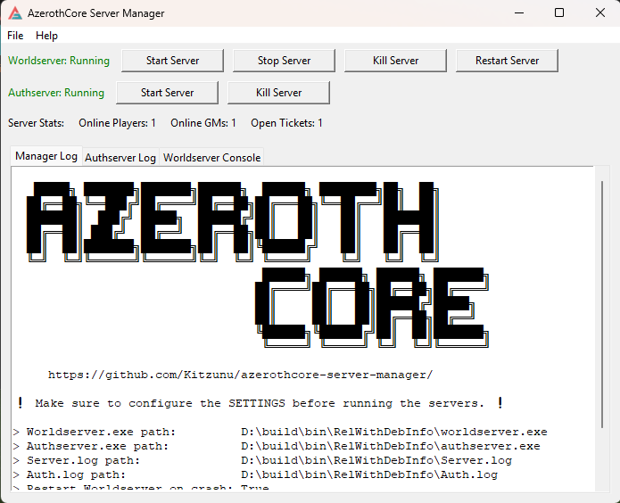
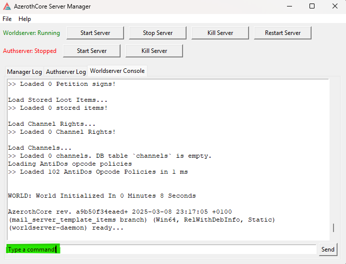

#  AzerothCore Server Manager

## Features

- Start/Stop your servers
- Keep 
- Worldserver auto restart on crash
- Restart the Worldserver safely
- Send commands to the WorldServer console directly

## Compile

**Requirements:**
- Python 3.0

**Installation:**
1. `python -m pip install pyinstaller`
2. `python -m pip install psutil`
3. `python -m PyInstaller --onefile --windowed --icon=assets/manager.ico --add-data "assets;assets" manager.py`
4. Find it in `D:\azerothcore-server-manager\dist`